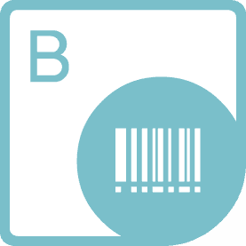
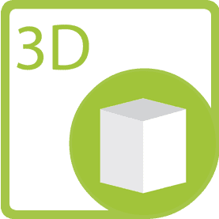
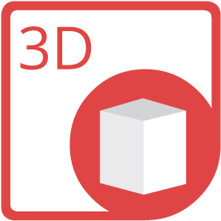
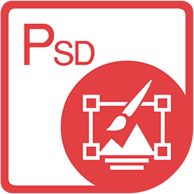



 aspose.com 
 

 
<h4 style="text-align: center ! important;">File format manipulation APIs that support more than 100 file formats across multiple platforms.</h4>

<a href="https://www.aspose.com" rel="alternate">Visit Website</a>

 

Product families include:

 
     
    <a href="/aspose/com#total" rel="alternate">Aspose.Total</a></li>
    <a href="/aspose/com#cells" rel="alternate">Aspose.Cells</a></li>
    <a href="/aspose/com#imaging" rel="alternate">Aspose.Imaging</a></li>
    <a href="/aspose/com#tasks" rel="alternate">Aspose.Tasks</a></li>
    <a href="/aspose/com#cad" rel="alternate">Aspose.CAD</a></li>
    <a href="/aspose/com#gis" rel="alternate">Aspose.GIS</a></li>
    <a href="/aspose/com#page" rel="alternate">Aspose.Page</a></li>
    <a href="/aspose/com#pub" rel="alternate">Aspose.PUB</a></li>
    <a href="/aspose/com#drawing" rel="alternate">Aspose.Drawing</a></li>
     
     
    <a href="/aspose/com#words" rel="alternate">Aspose.Words</a></li>
    <a href="/aspose/com#email" rel="alternate">Aspose.Email</a></li>
    <a href="/aspose/com#barcode" rel="alternate">Aspose.BarCode</a></li>
    <a href="/aspose/com#ocr" rel="alternate">Aspose.OCR</a></li>
    <a href="/aspose/com#3d" rel="alternate">Aspose.3D</a></li>
    <a href="/aspose/com#zip" rel="alternate">Aspose.ZIP</a></li>
    <a href="/aspose/com#psd" rel="alternate">Aspose.PSD</a></li>
    <a href="/aspose/com#svg" rel="alternate">Aspose.SVG</a></li>
    <a href="/aspose/com#font" rel="alternate">Aspose.Font</a></li>
     
     
    <a href="/aspose/com#pdf" rel="alternate">Aspose.PDF</a></li>
<a href="/aspose/com#slides" rel="alternate">Aspose.Slides</a></li>
<a href="/aspose/com#diagram" rel="alternate">Aspose.Diagram</a></li>
<a href="/aspose/com#note" rel="alternate">Aspose.Note</a></li>
<a href="/aspose/com#html" rel="alternate">Aspose.HTML</a></li>
<a href="/aspose/com#omr" rel="alternate">Aspose.OMR</a></li>
<a href="/aspose/com#finance" rel="alternate">Aspose.Finance</a></li>
<a href="/aspose/com#tex" rel="alternate">Aspose.TeX</a></li>
     
 
 

 
 
 
 

 
 
 
<h3 style="text-align: center ! important;">Aspose.Total Product Family</h3>
<h4 style="text-align: center ! important;">Enable your applications to manipulate more than 100 file formats. Includes all of our individual products.</h4>
 
 
 
    

    <a href="https://products.aspose.com/total/net">
        Aspose.Total for <em>.NET</em>  <em>Target Windows Forms, ASP.NET, WPF, WCF or any type of application based on .NET Framework 2.0 or later.</em>
    </a>
 
 
    

    <a href="https://products.aspose.com/total/java">
        Aspose.Total for <em>Java</em><em>Native Java APIs for the desktop, web or any kind of application based on Java SE or EE.</em>
    </a>
 
 
     

    <a href="https://products.aspose.com/total/cpp">
        Aspose.Total for <em>C++</em><em>Create, manipulate, convert or render Word documents, Excel spreadsheets, PowerPoint presentations, email messages &amp; PDF files in C++ applications.</em>
    </a>
 
 
 
     

    <a href="https://products.aspose.com/total/android-java">
        Aspose.Total for <em>Android via Java</em><em>Manipulate Word, Excel, PowerPoint and other formats in mobile apps. It works with Android OS 2.3 or later.</em>
    </a>
 
 
    

    <a href="https://products.aspose.com/total/sharepoint">
        Aspose.Total for <em>SharePoint</em><em>Convert Word, Excel, PowerPoint and other formats in SharePoint Foundation and Server.</em>
    </a>
 

 
     

    <a href="https://products.aspose.com/total/reporting-services">
        Aspose.Total for <em>Reporting Services</em><em>Export RDL reports to Word, Excel, PowerPoint and other formats from SQL Server Reporting Services.</em>
    </a>
 
 
 
    

    <a href="https://products.aspose.com/total/jasperreports">
        Aspose.Total for <em>JasperReports</em><em>Export reports to Word, Excel, PowerPoint and other formats from JasperReports or JasperServer.</em>
    </a>
 
 

 
 
 
 
<h3 style="text-align: center ! important;">Aspose.Words Product Family</h3>
<h4 style="text-align: center ! important;">Develop high performance apps to Create, Edit, Convert or Print Word document formats, using our native APIs for .NET, Java, Android and Xamarin.</h4>
 
    

    <a href="https://products.aspose.com/words/net">
        Aspose.Words for <em>.NET</em><em>Target .NET Framework, .NET Core &amp; Xamarin platform to develop applications for Windows, iOS, macOS &amp; Android.<!--Target Windows Forms, ASP.NET, WPF, WCF or any type of application based on .NET Framework 2.0 or later.--></em>
    </a>

 

        <a href="https://products.aspose.com/words/java">Aspose.Words for <em>Java</em><em>Native Java APIs for the desktop, web or any kind of application based on Java SE or EE.</em></a>
 
 

        <a href="https://products.aspose.com/words/cpp">Aspose.Words for <em>C++</em><em>Add Word document processing capabilities to C++ applications developed on Windows platform.</em></a>
 
 
 
 

        <a href="https://products.aspose.com/words/android-java">Aspose.Words for <em>Android via Java</em><em>Add document processing capabilities in your Android mobile applications.</em></a>
 
 

        <!--<a href="https://products.aspose.com/words/sharepoint">Aspose.Words for <em>SharePoint</em><em>Convert and combine Word documents in SharePoint Services 3.0, SharePoint Server 2007 or later.</em></a>--> <a href="https://products.aspose.com/words/sharepoint">Aspose.Words for <em>SharePoint</em><em>Convert and combine Word documents in SharePoint Services and SharePoint Servers.</em></a>
 
 

        <a href="https://products.aspose.com/words/reporting-services">Aspose.Words for <em>Reporting Services</em><em>Export RDL and RDLC reports to Word and PDF from SQL Server Reporting Services.</em></a>
 
 
 

<a href="https://products.aspose.com/words/jasperreports">Aspose.Words for <em>JasperReports</em><em>Export reports to Word and HTML formats from JasperReports or JasperServer.</em></a>
 
 

 
 
 
 
<h3 style="text-align: center ! important;">Aspose.PDF Product Family</h3>
<h4 style="text-align: center ! important;">Develop high performance apps to Create, Edit or Convert PDF file formats, using our native APIs for .NET, Java and Android.</h4>
 

<a href="https://products.aspose.com/pdf/net">Aspose.PDF for <em>.NET</em><em>Target Windows Forms, ASP.NET, WPF, WCF or any type of application based on .NET Framework 2.0 or later.</em></a>   
 
 

<a href="https://products.aspose.com/pdf/java">Aspose.PDF for <em>Java</em><em>Native Java APIs for the desktop, web or any kind of application based on Java SE or EE.</em></a>   
 
 
  

 <a href="https://products.aspose.com/pdf/cpp">Aspose.PDF for <em>C++</em><em>Create, read, edit or render PDF documents from within C++ applications.</em></a>
 
 
 

<a href="https://products.aspose.com/pdf/android-java">Aspose.PDF for <em>Android via Java</em><em>Add PDF manipulation capabilities in your Android mobile applications.</em></a>
 
 

<a href="https://products.aspose.com/pdf/sharepoint">Aspose.PDF for <em>SharePoint</em><em>Export lists to PDF documents in SharePoint Foundation and SharePoint Server.</em></a>
  
 
 

 <a href="https://products.aspose.com/pdf/reporting-services">Aspose.PDF for <em>Reporting Services</em><em>Export RDL reports to PDF and XPS file formats from SQL Server Reporting Services.</em></a>
 
 


<a href="https://products.aspose.com/pdf/jasperreports">Aspose.PDF for <em>JasperReports</em><em>Export reports to PDF from JasperReports or JasperServer.</em></a>
    
 

 
 
 
 
<h3 style="text-align: center ! important;">Aspose.Cells Product Family</h3>
<h4 style="text-align: center ! important;">Develop efficient applications to Create, Edit, Convert or Render Excel spreadsheets, using our native APIs for .NET, Java and Android</h4>
 

<a href="https://products.aspose.com/cells/net">Aspose.Cells for <em>.NET</em><em>Target .NET Framework, .NET Core &amp; Xamarin platform to develop applications for Windows, iOS, macOS &amp; Android.</em></a>
 
 
 

<a href="https://products.aspose.com/cells/java">Aspose.Cells for <em>Java</em><em>Native Java APIs for the desktop, web or any kind of application based on Java SE or EE.</em></a> 
 
 
 

<a href="https://products.aspose.com/cells/cpp">Aspose.Cells for <em>C++</em><em>Create, read, edit, convert or render Excel spreadsheets formats from within C++ applications.</em></a>
 
 
 

<a href="https://products.aspose.com/cells/android-java">Aspose.Cells for <em>Android via Java</em><em>Add Excel spreadsheet manipulation capabilities in your Android mobile applications.</em></a> 
 
 

<a href="https://products.aspose.com/cells/sharepoint">Aspose.Cells for <em>SharePoint</em><em>Convert and combine Excel spreadsheets in SharePoint Services or SharePoint Server.</em></a>
 
 

<a href="https://products.aspose.com/cells/reporting-services">Aspose.Cells for <em>Reporting Services</em><em>Export RDL and RDLC reports to Excel file formats from SQL Server Reporting Services.</em></a>   
 
 


<a href="https://products.aspose.com/cells/jasperreports">Aspose.Cells for <em>JasperReports</em><em>Export reports to Excel file formats and PDF from JasperReports or JasperServer.</em></a>
   
 

<a href="https://products.aspose.com/cells/jasperreports">Aspose.Cells for <em>JasperReports</em><em>Export reports to Excel file formats and PDF from JasperReports or JasperServer.</em></a>  
 
 

<a href="https://products.aspose.com/cells/nodejs-java">Aspose.Cells for <em>Node.js via Java</em><em>Create, manipulate, convert &amp; render Excel spreadsheets via Node.js.</em></a>
 
 
 

<a href="https://products.aspose.com/cells/php-java">Aspose.Cells for <em>PHP via Java</em><em>Create, manipulate, convert &amp; render Excel spreadsheets in PHP applications via JavaBridge.</em></a>
 
 

<a href="https://products.aspose.com/cells/python-java">Aspose.Cells for <em>Python via Java</em><em>Load, create, manipulate &amp; render Excel documents using Python.</em></a>  
 
 

 
 
 
 
<h3 style="text-align: center ! important;">Aspose.Email Product Family</h3>
<h4 style="text-align: center ! important;">Deliver faster apps to Create, Edit or Convert Outlook Email file formats and popular network protocols, using our native APIs for .NET, Java and Android.</h4>
 

<a href="https://products.aspose.com/email/net">Aspose.Email for <em>.NET</em><em>Target .NET Framework, .NET Core &amp; Xamarin platform to develop applications for Windows, iOS, macOS &amp; Android.</em></a>
 
 

<a href="https://products.aspose.com/email/java">Aspose.Email for <em>Java</em><em>Native Java APIs for desktop, web or any kind of application based on Java SE or EE.</em></a>
 
 

<a href="https://products.aspose.com/email/cpp">Aspose.Email for <em>C++</em><em>Create, manipulate or convert email messages in C++ applications.</em></a>
 
 
 

<a href="https://products.aspose.com/email/android-java">Aspose.Email for <em>Android via Java</em><em>Manipulate Outlook Email messages in your Android mobile applications.</em></a>
 
 

<a href="https://products.aspose.com/email/sharepoint">Aspose.Email for <em>SharePoint</em><em>Convert emails and synchronize files to FTP or Dropbox in SharePoint.</em></a>
 
 

<a href="https://products.aspose.com/email/python-net">Aspose.Email for <em>Python via .NET</em><em>Python library to create, manipulate, convert, send or receive email messages.</em></a>
 
 
 

 
 
 
 
<h3 style="text-align: center ! important;">Aspose.Slides Product Family</h3>
<h4 style="text-align: center ! important;">Deliver high performance apps to Create, Edit or Convert PowerPoint Presentation files, using our native APIs for .NET, Java and Android.</h4>
 

<a href="https://products.aspose.com/slides/net">Aspose.Slides for <em>.NET</em><em>Target Windows Forms, ASP.NET, WPF, WCF or any type of application based on .NET Framework 2.0 or later.</em></a>
 
 

<a href="https://products.aspose.com/slides/java">Aspose.Slides for <em>Java</em><em>Native Java APIs for the desktop, web or any kind of application based on Java SE or EE.</em></a>
 
 
 

<a href="https://products.aspose.com/slides/cpp">Aspose.Slides for <em>C++</em><em>Manipulate &amp; render PowerPoint presentations &amp; slides in C++ applications.</em></a>
 
 
 

<a href="https://products.aspose.com/slides/android-java">Aspose.Slides for <em>Android via Java</em><em>Manipulate PowerPoint Presentations within your Android mobile applications.</em></a> 
 
 

<a href="https://products.aspose.com/slides/sharepoint">Aspose.Slides for <em>SharePoint</em><em>Convert PowerPoint presentations to PDF in SharePoint.</em></a>
 
 
 

 <a href="https://products.aspose.com/slides/reporting-services">Aspose.Slides for <em>Reporting Services</em><em>Export RDL reports to PowerPoint from SQL Server Reporting Services.</em></a>
 
 
 

<a href="https://products.aspose.com/slides/jasperreports">Aspose.Slides for <em>JasperReports</em><em>Export reports to PowerPoint from JasperReports or JasperServer.</em></a>
 
 

<a href="https://products.aspose.com/slides/net-core">Aspose.Slides for <em>.NET Core</em><em>Build .NET Core cross-platform solutions for processing presentations on Windows, Linux or macOS.</em></a>
 
 

<a href="https://products.aspose.com/slides/xamarin">Aspose.Slides for <em>Xamarin</em><em>Create Xamarin cross-platform applications for managing presentations on Android, iOS or Windows.</em></a>
 
   
 

 
 
 
 
<h3 style="text-align: center ! important;">Aspose.Imaging Product Family</h3>
<h4 style="text-align: center ! important;">Deliver faster apps to Create, Draw, Manipulate or Convert image file formats, using our native APIs for .NET and Java.</h4>
 

<a href="https://products.aspose.com/imaging/net">Aspose.Imaging for <em>.NET</em><em>Target Windows Forms, ASP.NET, WPF, WCF or any type of application based on .NET Framework 2.0 or later.</em></a>
 
 

<a href="https://products.aspose.com/imaging/java">Aspose.Imaging for <em>Java</em><em>Native Java APIs for desktop, web or any kind of application based on Java SE or EE.</em></a>
 
 
 

<a href="https://products.aspose.com/imaging/sharepoint">Aspose.Imaging for <em>SharePoint</em><em>Convert images in SharePoint Foundation or Server.</em></a>
 
 
 
 

<a href="https://products.aspose.com/imaging/jasperreports">Aspose.Imaging for <em>JasperReports</em><em>Export reports to mutiple image formats from JasperReports.</em></a>
  
 

 
 
 
 
<h3 style="text-align: center ! important;">Aspose.BarCode Product Family</h3>
<h4 style="text-align: center ! important;">Develop high performance apps to generate or recognize 1D, 2D and postal barcodes, using our native APIs for .NET and Java.</h4>
 

<a href="https://products.aspose.com/barcode/net">Aspose.BarCode for <em>.NET</em><em>Target Windows Forms, ASP.NET, WPF, WCF or any type of application based on .NET Framework 2.0 or later.</em></a>
 
 

<a href="https://products.aspose.com/barcode/java">Aspose.BarCode for <em>Java</em><em>Native Java APIs for the desktop, web or any kind of application based on Java SE or EE.</em></a>
 
 
 

<a href="https://products.aspose.com/barcode/cpp">Aspose.BarCode for <em>C++</em><em>Generate or recognize 1D &amp; 2D barcode types from within C++ applications.</em></a>
 
 
 

<a href="https://products.aspose.com/barcode/android-java">Aspose.BarCode for <em>Android via Java</em><em>Add barcode generation &amp; recognition capabilities to your Android mobile apps.</em></a>
 
 

<a href="https://products.aspose.com/barcode/sharepoint">Aspose.BarCode for <em>SharePoint</em><em>Add barcodes to lists in SharePoint Foundation and SharePoint Server.</em></a>
 
 
 

<a href="https://products.aspose.com/barcode/reporting-services">Aspose.BarCode for <em>Reporting Services</em><em>Render barcode images in SQL Server Reporting Services.</em></a>
 
 


<a href="https://products.aspose.com/barcode/jasperreports">Aspose.BarCode for <em>JasperReports</em><em>Add barcode images in reports in JasperReports or JasperServer.</em></a>
   


<a href="https://products.aspose.com/barcode/php-java">Aspose.BarCode for <em>PHP via Java</em><em>Generate and recognize barcodes in PHP applications via JavaBridge.</em></a>



<a href="https://products.aspose.com/barcode/nodejs-java">Aspose.BarCode for <em>Node.js via Java</em><em>Manage barcode generation and recognition functionality within Node.js applications.</em></a>
 
 

 
 
 
 
<h3 style="text-align: center ! important;">Aspose.Diagram Product Family</h3>
<h4 style="text-align: center ! important;">Deliver high performance apps to Create, Edit or Convert Microsoft Visio® document formats, using our native APIs for .NET and Java.</h4>
 

<a href="https://products.aspose.com/diagram/net">Aspose.Diagram for <em>.NET</em><em>Target Windows Forms, ASP.NET, WPF, WCF or any type of application based on .NET Framework 2.0 or later.</em></a>
 
 

<a href="https://products.aspose.com/diagram/java">Aspose.Diagram for <em>Java</em><em>Native Java APIs for desktop, web or any kind of application based on Java SE or EE.</em></a>
 
 
 

<a href="https://products.aspose.com/diagram/nodejs-java">Aspose.Diagram for <em>Node.js via Java</em><em>Create, read, write &amp; render Microsoft Visio documents via Node.js.</em></a>
 
 
 

 
 
 
 
<h3 style="text-align: center ! important;">Aspose.Tasks Product Family</h3>
<h4 style="text-align: center ! important;">Develop high performance apps to Create, Edit or Convert Microsoft Project® document formats, using our native APIs for .NET and Java.</h4>
 

<a href="https://products.aspose.com/tasks/net"> Aspose.Tasks for <em>.NET</em><em>Target Windows Forms, ASP.NET, WPF, WCF or any type of application based on .NET Framework 2.0 or later.</em></a>  
 
 

<a href="https://products.aspose.com/tasks/java"> Aspose.Tasks for <em>Java</em><em>Native Java APIs for the desktop, web or any kind of application based on Java SE or EE.</em></a>   
 
 
 

<a href="https://products.aspose.com/tasks/cpp"> Aspose.Tasks for <em>C++</em><em>C++ library to read, write and render Microsoft Project ® files without using Microsoft Project ®.</em></a> 
 
    
 

 
 
 
 
<h3 style="text-align: center ! important;">Aspose.OCR Product Family</h3>
<h4 style="text-align: center ! important;">Add OCR and OMR capabilities in your apps, using our native APIs for .NET and Java.</h4>
 

<a href="https://products.aspose.com/ocr/net"> Aspose.OCR for <em>.NET</em><em>Standalone .NET OCR API that enhances your .NET apps to perform OCR on images.</em> </a>
 
 
 

<a href="https://products.aspose.com/ocr/java"> Aspose.OCR for <em>Java</em><em>Native Java OCR API for desktop, web or any kind of application based on Java SE or EE.</em> </a>
 
 

<a href="https://products.aspose.com/ocr/cpp"> Aspose.OCR for <em>C++</em><em>Native C and C++ OCR API for performing OCR on both Windows and Linux.</em> </a>
 
   
 

 
 
 
 
<h3 style="text-align: center ! important;">Aspose.Note Product Family</h3>
<h4 style="text-align: center ! important;">Develop faster apps to Create, Edit or Convert Microsoft OneNote® document formats, using our native APIs for .NET and Java.</h4>
 

<a href="https://products.aspose.com/note/net">Aspose.Note for <em>.NET</em><em>Target Windows Forms, ASP.NET, WPF, WCF or any type of application based on .NET Framework 2.0 or later.</em></a>
 
 

<a href="https://products.aspose.com/note/java">Aspose.Note for <em>Java</em><em>Native Java APIs for desktop, web or any kind of application based on Java SE or EE.</em></a>  
  
 

 
 
 
 
<h3 style="text-align: center ! important;">Aspose.CAD Product Family</h3>
<h4 style="text-align: center ! important;">Develop faster apps to Convert AutoCAD DWG and DXF files to PDF and Raster images, using our native APIs for .NET and Java.</h4>
 

<a href="https://products.aspose.com/cad/net">Aspose.CAD for <em>.NET</em><em>Target Windows Forms, ASP.NET, WPF, WCF or any type of application based on .NET Framework 2.0 or later.</em></a> 
 
 

<a href="https://products.aspose.com/cad/java">Aspose.CAD for <em>Java</em><em>Native Java APIs for the desktop, web or any kind of application based on Java SE or EE.</em></a>
 
 

 
 
 
 
<h3 style="text-align: center ! important;">Aspose.3D Product Family</h3>
<h4 style="text-align: center ! important;">Create, edit and convert 3D documents in your .NET applications.</h4>
 

<a href="https://products.aspose.com/3d/net">Aspose.3D for <em>.NET</em><em>Target Windows Forms, ASP.NET, WPF, WCF or any type of application based on .NET Framework 2.0 or later.</em></a>
 
 

<a href="https://products.aspose.com/3d/java">Aspose.3D for <em>Java</em><em>Native Java APIs for the desktop, web or any kind of application based on Java SE or EE.</em></a>
   
 

 
 
 
 
<h3 style="text-align: center ! important;">Aspose.HTML Product Family</h3>
<h4 style="text-align: center ! important;">Develop high performance apps to Create, Edit and Convert HTML pages using our native APIs for .NET &amp; Java.</h4>
 

<a href="https://products.aspose.com/html/net">Aspose.HTML for <em>.NET</em><em>Target Windows Forms, ASP.NET, WPF, WCF or any type of application based on .NET Framework 2.0 or later.</em></a>
 
 

<a href="https://products.aspose.com/html/java">Aspose.HTML for <em>Java</em><em>Native Java APIs for the desktop, web or any kind of application based on Java SE or EE.</em></a>
   
 

 
 
 
 
<h3 style="text-align: center ! important;">Aspose.GIS Product Family</h3>
<h4 style="text-align: center ! important;">Develop high performance apps to Create, Edit and Convert GIS file formats using our native APIs for .NET.</h4>
 

<a href="https://products.aspose.com/gis/net">Aspose.GIS for <em>.NET</em><em>Target Windows Forms, ASP.NET, WPF, WCF or any type of application based on .NET Framework 4.7 or later.</em></a>
 
 

 
 
 
 
<h3 style="text-align: center ! important;">Aspose.ZIP Product Family</h3>
<h4 style="text-align: center ! important;">Compress archives and files into zip format as well as extract zip files to its respective folders and documents.</h4>
 

<a href="https://products.aspose.com/zip/net"> Aspose.ZIP for <em>.NET</em><em>Target Windows Forms, ASP.NET, WPF, WCF or any type of application based on .NET Framework 2.0 or later.</em></a>
   
 

 
 
 
 
<h3 style="text-align: center ! important;">Aspose.Page Product Family</h3>
<h4 style="text-align: center ! important;">Create or manipulate XPS files. Convert XPS, EP &amp; EPS documents to PDF and various images without any software dependencies.</h4>
 

<a href="https://products.aspose.com/page/net">Aspose.Page for <em>.NET</em><em>Target Windows Forms, ASP.NET or any type of application based on .NET Framework 2.0 or later.</em></a>
 
 

<a href="https://products.aspose.com/page/java">Aspose.Page for <em>Java</em><em>Native Java APIs for the desktop, web or any kind of application based on Java SE or EE.</em></a>
 
 
 

<a href="https://products.aspose.com/page/cpp">Aspose.Page for <em>C++</em><em>Create, load, manipulate, or render Postscript and XPS files to Image formats and PDF within pure C++ applications.</em></a>
 
   
 

 
 
 
 
<h3 style="text-align: center ! important;">Aspose.PSD Product Family</h3>
<h4 style="text-align: center ! important;">Load, create or edit Photoshop PSD &amp; PSB files in your application.</h4>
 

<a href="https://products.aspose.com/psd/net">Aspose.PSD for <em>.NET</em><em>Target Windows Forms, ASP.NET or any type of application based on .NET Framework 2.0 or later.</em></a>
 
 

<a href="https://products.aspose.com/psd/java">Aspose.PSD for <em>Java</em><em>Native Java APIs for the desktop, web or any kind of application based on Java SE or EE.</em></a>
   
 

 
 
 
 
<h3 style="text-align: center ! important;">Aspose.OMR Product Family</h3>
<h4 style="text-align: center ! important;">On Premise &amp; Cloud APIs to perform OMR for capturing human-marked data from document scans or photo.</h4>
 

<a href="https://products.aspose.com/omr/net">Aspose.OMR for <em>.NET</em><em>Target Windows Forms, ASP.NET, WPF, WCF or any type of application based on .NET Framework 4.0 or later.</em></a>
 
 

<a href="https://products.aspose.com/omr/java">Aspose.OMR for <em>Java</em><em>Native Java APIs for the desktop, web or any kind of application based on Java SE or EE.</em></a>
  
 

 
 
 
 
<h3 style="text-align: center ! important;">Aspose.PUB Product Family</h3>
<h4 style="text-align: center ! important;">On Premise APIs and free apps for PUB file format conversion, with no dependency on any other software.</h4>
 

<a href="https://products.aspose.com/pub/net">Aspose.PUB for <em>.NET</em><em>Target Windows Forms, ASP.NET or any type of application based on .NET Framework 3.5 or later.</em></a>
 
 

<a href="https://products.aspose.com/pub/java">Aspose.PUB for <em>Java</em><em>Native Java APIs for the desktop, web or any kind of application based on Java SE or EE.</em></a>

 

<a href="https://products.aspose.com/pub/cpp">Aspose.PUB for <em>C++</em><em>Parse .pub files as well as convert to PDF within C++ applications developed on Windows platform.</em></a>

 

 
 
 
 
<h3 style="text-align: center ! important;">Aspose.SVG Product Family</h3>
<h4 style="text-align: center ! important;">On Premise APIs and free apps for SVG file format parsing and rendering with no dependency on any other software.</h4>
 

<a href="https://products.aspose.com/svg/net">Aspose.SVG for <em>.NET</em><em>Target Windows Forms, ASP.NET or any type of application based on .NET Framework  4.0 or later.</em></a>
    
 

 
 
 
 
<h3 style="text-align: center ! important;">Aspose.Finance Product Family</h3>
<h4 style="text-align: center ! important;">On-Premise APIs and free apps for digital financial reporting solutions, XBRL financial statements, and more with no dependency on any other software.</h4>
 

<a href="https://products.aspose.com/finance/net">Aspose.Finance for <em>.NET</em><em>Target Windows Forms, ASP.NET or any type of application based on .NET Framework 2.0 or later.</em></a>
  
 

 
 
 
 
<h3 style="text-align: center ! important;">Aspose.Drawing Product Family</h3>
<h4 style="text-align: center ! important;">On Premise APIs and free apps having the capability of processing 2D drawings identical to GDI+, with no dependency on any other software.</h4>
 

<a href="https://products.aspose.com/drawing/net">Aspose.Drawing for <em>.NET</em><em>Target Windows Forms, ASP.NET or any type of application based on .NET Framework 2.0 or later.</em></a>
   
 

 
 
 
 
<h3 style="text-align: center ! important;">Aspose.Font Product Family</h3>
<h4 style="text-align: center ! important;">On Premise APIs and free apps for multiple font formats loading and drawing, with no dependency on any other software.</h4>
 

<a href="https://products.aspose.com/font/net">Aspose.Font for <em>.NET</em><em>Target Windows Forms, ASP.NET or any type of application based on .NET Framework 3.5 or later.</em></a>
 
 

<a href="https://products.aspose.com/font/java">Aspose.Font for <em>Java</em><em>Native Java APIs for the desktop, web or any kind of application based on Java SE or EE..</em></a>
 
 
 

<a href="https://products.aspose.com/font/cpp">Aspose.Font for <em>C++</em><em>Add Font integration and manipulation capabilities to C++ applications.</em></a>
 
 
 

 
 
 
 
<h3 style="text-align: center ! important;">Aspose.TeX Product Family</h3>
<h4 style="text-align: center ! important;">On Premise APIs and free apps for working with typeset TeX files within .NET based applications, with no dependency on any other software.</h4>
 

<a href="https://products.aspose.com/tex/net">Aspose.TeX for  <em>.NET</em><em>Target Windows Forms, ASP.NET or any type of application based on .NET Framework 2.0 or later.</em></a>
 
 

<a href="https://products.aspose.com/tex/java">Aspose.TeX for <em>Java</em><em>Native Java APIs for the desktop, web or any kind of application based on Java SE or EE.</em></a>
 
 
 

<a href="https://products.aspose.com/tex/cpp">Aspose.TeX for <em>C++</em><em>Integrate TeX files typesetting into C++ applications.</em></a>
 
 
 

 
 
 

 

  

